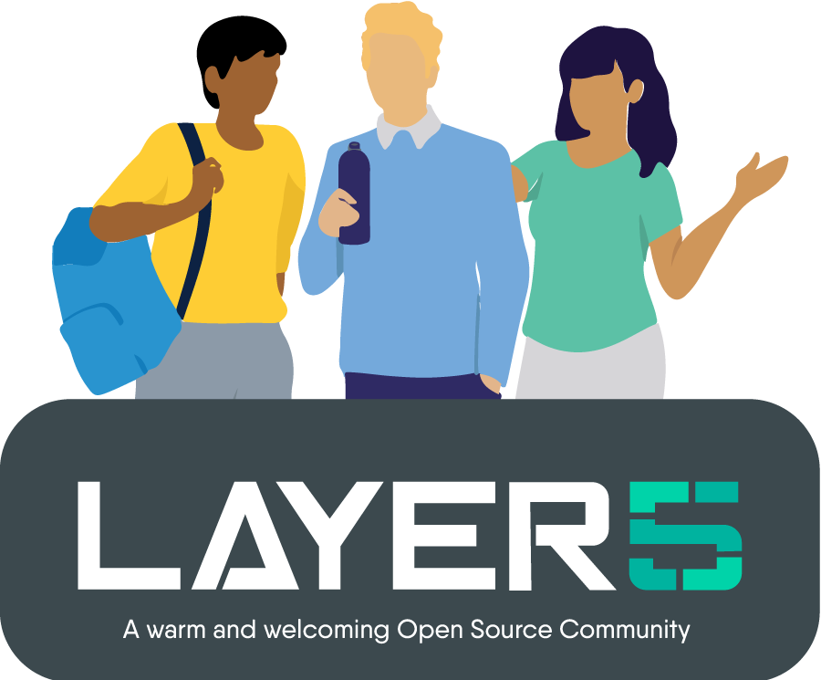

<p align="center">
  <picture>
    <source media="(prefers-color-scheme: dark)" srcset="site/assets/brand/logo/blowhorn-lockup-horizontal-on-dark.svg">
    
  </picture>
</p>

# Blowhorn site and downloads

This repository is two things for **Layer5 Blowhorn**:

1. **The marketing site** at [blowhorn.ai](https://blowhorn.ai). The source is the static site in [`site/`](site/), deployed to GitHub Pages by [`site.yml`](.github/workflows/site.yml). The Pages custom domain is already blowhorn.ai, so the project URL <https://layer5io.github.io/blowhorn-site/> only redirects there; the site is reachable once the domain's DNS points at Pages, as [`docs/deploy.md`](docs/deploy.md) describes.
2. **Public downloads.** macOS disk images and their checksums are published as [GitHub Releases](https://github.com/layer5io/blowhorn-site/releases) on this repository. No release binary is committed here.

Blowhorn is a social media console that takes one message and broadcasts, reposts and amplifies it across every profile and platform your community runs, on autopilot. One message. Many ears.

## Download

Once the first stable release is public, this link always points at the newest universal macOS build:

```
https://github.com/layer5io/blowhorn-site/releases/latest/download/Blowhorn-mac.dmg
```

Every release carries a `SHA256SUMS.txt`. Check the image before you open it:

```bash
shasum -a 256 -c SHA256SUMS.txt
```

The Chrome extension ships through the Chrome Web Store, not from this repository.

## Where things live

| | |
|---|---|
| Site source | [`site/`](site/): hand-written HTML, CSS and a little JavaScript, no framework, no build step beyond copying |
| Brand assets | [`site/assets/brand/`](site/assets/brand/): the files from version 1 of the brand kit that the pages use (lockups, favicons, Major Blowhorn, the social banner) and the three self-hosted fonts; attribution in [`LICENSES.md`](site/assets/brand/LICENSES.md) |
| How the site deploys and how the domain is wired | [`docs/deploy.md`](docs/deploy.md) |
| How releases are published | [`docs/distribution.md`](docs/distribution.md) |
| Release binaries | [Releases](https://github.com/layer5io/blowhorn-site/releases) on this repository |
| Product source and build pipeline | Private: [`leecalcote/blowhorn`](https://github.com/leecalcote/blowhorn) |

**Reporting problems.** The product repository is private, so use [this repository's issues](https://github.com/layer5io/blowhorn-site/issues) for everything public: site content, a download that will not open, a wrong checksum, or a bug in the app. Maintainers triage app bugs into the product repository. The [Layer5 Slack](https://slack.layer5.io) works too.

## Working on the site

You need `make`, Python 3 and Node.js (for `npx`). Nothing is installed into the repository.

```bash
make site-serve      # build into _site/ and serve at http://localhost:8080
make site-check      # html-validate plus the local link, image and font check (same as CI)
make workflow-check  # actionlint on this repository's workflows
make check           # both checks
```

The site follows the brand kit exactly: every colour, type style, spacing, radius and shadow in `site/styles.css` is a token from `brand/tokens.json` in the product repository (version 1 of the brand kit), with light as the default theme and dark following the operating system. Brand SVGs are used as files and never recoloured. The one-to-many hero illustration and the platform marks are inline SVG drawn in `currentColor`.

### CI

| Workflow | When | What it does |
|---|---|---|
| [`site.yml`](.github/workflows/site.yml) | Pull requests, pushes to `master`, manual runs | Lints the workflows, validates the site and builds the Pages artifact. On `master` it deploys the artifact to GitHub Pages. |
| [`publish-dmg.yml`](.github/workflows/publish-dmg.yml) | Manual, or `repository_dispatch` (`publish-dmg`) from product CI | Downloads a built DMG over HTTPS, checks it, verifies signing and notarization on a macOS runner (required for any public release), then creates the release with versioned assets, the `Blowhorn-mac.dmg` alias and checksums. Drafts by default; never overwrites. |

<div>&nbsp;</div>

## Join the Layer5 community!

<a name="contributing"></a><a name="community"></a>
Our projects are community-built and welcome collaboration. 👍 Be sure to see the <a href="https://layer5.io/community/newcomers">Layer5 Community Welcome Guide</a> for a tour of resources available to you and jump into our <a href="http://slack.layer5.io">Slack</a>!

<p style="clear:both;">
<a href ="https://layer5.io/community/meshmates"></a>
<h3>Find your MeshMate</h3>

<p>MeshMates are experienced Layer5 community members, who will help you learn your way around, discover live projects and expand your community network. 
Become a <b>Meshtee</b> today!</p>

Find out more on the <a href="https://layer5.io/community">Layer5 community</a>. <br />
<br /><br /><br /><br />
</p>

<div>&nbsp;</div>

<a href="https://slack.layer5.io">
  <picture align="right">
    <source media="(prefers-color-scheme: dark)" srcset=".github/readme/images//slack-dark-128.png"  width="110px" align="right" style="margin-left:10px;margin-top:10px;">
    <source media="(prefers-color-scheme: light)" srcset=".github/readme/images//slack-128.png" width="110px" align="right" style="margin-left:10px;padding-top:5px;">
    
  </picture>
</a>

<a href="https://meshery.io/community"></a>

<p>
✔️ <em><strong>Join</strong></em> any or all of the weekly meetings on <a href="https://calendar.google.com/calendar/b/1?cid=bGF5ZXI1LmlvX2VoMmFhOWRwZjFnNDBlbHZvYzc2MmpucGhzQGdyb3VwLmNhbGVuZGFyLmdvb2dsZS5jb20">community calendar</a>.<br />
✔️ <em><strong>Watch</strong></em> community <a href="https://www.youtube.com/playlist?list=PL3A-A6hPO2IMPPqVjuzgqNU5xwnFFn3n0">meeting recordings</a>.<br />
✔️ <em><strong>Access</strong></em> the <a href="https://drive.google.com/drive/u/4/folders/0ABH8aabN4WAKUk9PVA">Community Drive</a> by completing a community <a href="https://layer5.io/newcomer">Member Form</a>.<br />
✔️ <em><strong>Discuss</strong></em> in the <a href="https://discuss.layer5.io">Community Forum</a>.<br />
✔️<em><strong>Explore more</strong></em> in the <a href="https://layer5.io/community/handbook">Community Handbook</a>.<br />
</p>
<p align="center">
<i>Not sure where to start?</i> Grab an open issue with the <a href="https://github.com/issues?q=is%3Aopen+is%3Aissue+archived%3Afalse+(org%3Alayer5io+OR+org%3Ameshery+OR+org%3Ameshery-extensions+OR+org%3Alayer5labs+OR+org%3Aservice-mesh-performance+OR+org%3Aservice-mesh-patterns+OR+org%3Ameshery-extensions)+label%3A%22help+wanted%22">help-wanted label</a>.</p>
